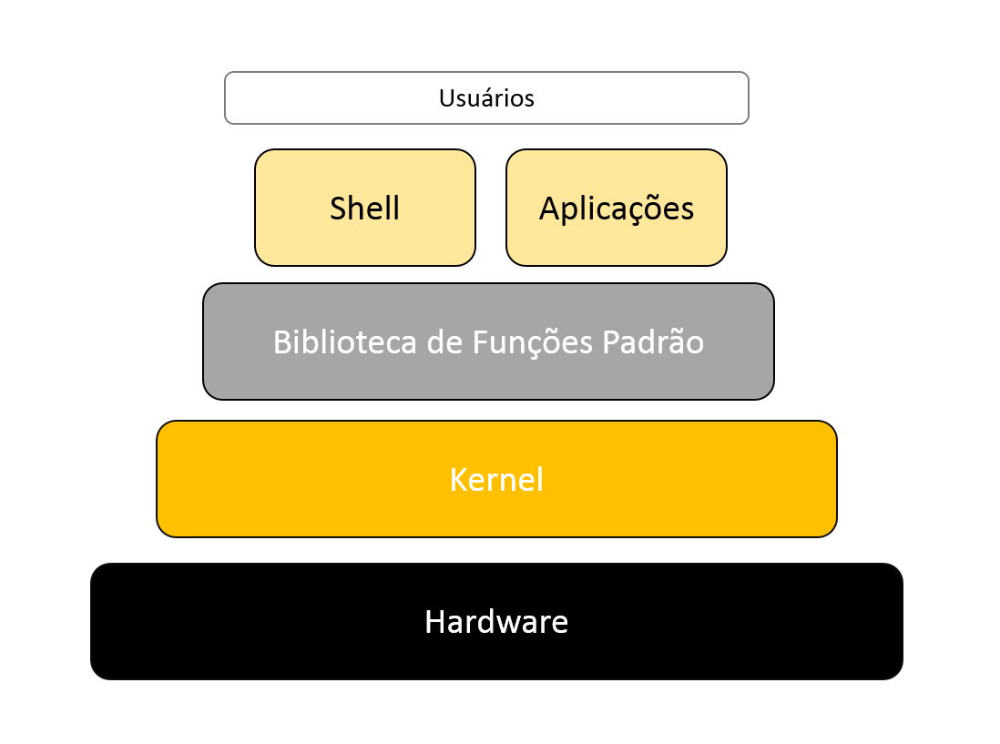

# Diário de Bordo
## Aula 02: Fundamentos de TI
### Dia 18/06/2024

### Simbiose Hardware e Software
Para o correto entendimento, há um vínculo entre os dois. Enquanto o hardware é a parte física, o software é a parte "pensante".  Eles estão interligados para a execução das tarefas, formam um todo integrado e articulado.

### Componentes Principais Hardware
- Placa mãe: conecta todos os componente internos do cabinente, essas conexões são feitas por meio de barramentos
- Processador: tambêm conhecido como **CPU**, ele realiza o processado das informações, as operações matemáticas complexas. Em uma analogia a uma biblioteca, seria nos que lemos os livros em uma biblioteca e fazemos as operações desejadas, como a busca de informações, síntese de idéias.
- Memória: é ela que permite a leitura e escrita dos arquivos, os programas são abertos nela. Novamente em uma analogia a biblioteca, a memória é a mesa onde os livros são dispostos, quanto mais espaço e mais mesas, mais livros podem ser abertos

### Interligação Hardware e Software

- O kernel: é o nucleo do Sistema Operacional-SO- estabelece o comando primário entre o hardware e software, requisita a ele a parte de processador e memória necessário.
- Biblioteca de Funções: necessário para a execução do SO, algoritmos prontos do próprio sistema
- Shell: antigo prompt de comando, no windows 11, powershell, camada mais baixa, usada pelo programador para uma comunicação mais direta com o hardware

### Software
- É a parte mais inteligente, não tocável e lógica. Os programas chamados agora de aplicações são rodados no SO.
- Interface: meio de comunicação
- IDE: interface de comunicação
- VSCode: editor de códigos
- Extensões: é o tipo, a natureza, do que o arquivo é, por exemplo .pdf arquivo de texto, leitura, .png é um arquivo de imagem

### Linguagem de Marcação
É a linguagem que está sendo utilizada no momento, foi ensinado como paragrafar, usar o recurso de item, subitem, colocar palavras em negrito com os códigos próprios a essa linguagem